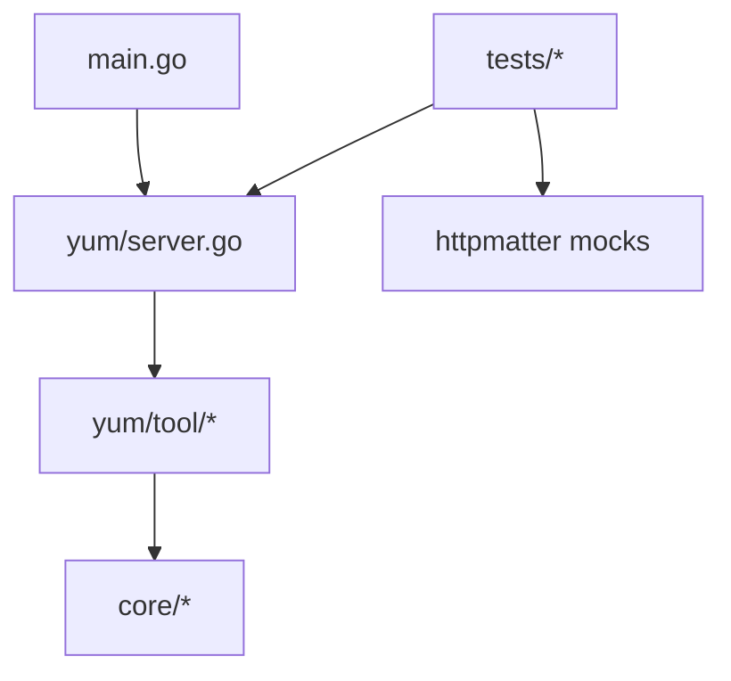

# Contributing to YouTube Uploader MCP

Thank you for your interest in contributing! This project is an open-source Go MCP server licensed under the [MIT License](LICENSE). For user-facing documentation (installation, OAuth setup, tool usage), see the [README](README.md).

## Ways to Contribute

- **Bug reports** — Open a GitHub issue with steps to reproduce, expected vs. actual behavior, and your environment (OS, Go version).
- **Features** — For larger changes, open an issue first to discuss the approach before investing in a PR.
- **Documentation** — Fix typos, clarify setup steps, or improve tool descriptions.
- **Tests** — Add or extend tests, especially for new API interactions.
- **New MCP tools** — Follow the guide below to add tools that wrap YouTube Data API functionality.

There are no issue or PR templates yet. Please include enough context in your issue or PR description for maintainers to review efficiently.

## Development Setup

### Prerequisites

- [Go 1.24+](https://go.dev/dl/) (matches `go.mod` and CI)

### Clone and build

```bash
git clone https://github.com/anwerj/youtube-uploader-mcp.git
cd youtube-uploader-mcp
go mod download
go build -o youtube-uploader-mcp .
```

Or build for a specific platform using the [Makefile](Makefile):

```bash
make darwin-arm64   # macOS Apple Silicon
make linux-amd64    # Linux x86_64
```

### Manual testing (optional)

To run the server locally against real YouTube APIs, you need a Google OAuth `client_secret.json`. Follow [youtube_oauth2_setup.md](youtube_oauth2_setup.md), then:

```bash
./youtube-uploader-mcp -client_secret_file /path/to/client_secret.json
```

**Never commit** real `client_secret.json` files, OAuth tokens, channel cache files, or personal logs.

## Project Layout



| Path | Role |
|------|------|
| [main.go](main.go) | CLI flags, starts stdio MCP server |
| [yum/server.go](yum/server.go) | Builds server, registers tools |
| [yum/tool/](yum/tool/) | MCP tool handlers (`Define` + `Handle`) |
| [yum/tool.go](yum/tool.go) | `Tool` interface definition |
| [core/](core/) | YouTube API / OAuth business logic |
| [hook/](hook/) | MCP server hooks |
| [logn/](logn/) | Logging |
| [tests/](tests/) | Integration tests via `testify/suite` + `httpmatter` |

## Adding or Changing an MCP Tool

1. **Service logic** — Add or extend functions in [core/](core/) (e.g. [core/video.go](core/video.go)).
2. **Tool handler** — Create a file in [yum/tool/](yum/tool/) implementing the `Tool` interface:

```go
type Tool interface {
    Name() string
    Define(ctx context.Context) mcp.Tool
    Handle(ctx context.Context, request mcp.CallToolRequest) (*mcp.CallToolResult, error)
}
```

   - **Define**: Use `mcp.NewTool` with `mcp.WithString`, `mcp.WithDescription`, etc.
   - **Handle**: Extract arguments, validate inputs, call `core/` functions, return results via `mcp.NewToolResultText` or `mcp.NewToolResultError`.

3. **Registration** — Add the tool to the `tools` slice in [yum/server.go](yum/server.go).
4. **Tests** — Add tests in [tests/](tests/) using the `YumSuite` pattern ([tests/suite_test.go](tests/suite_test.go)):
   - Add paired request/response fixtures under [tests/data/outgoing/](tests/data/outgoing/) (`*_request.http` / `*_response.http`).
   - Assert outgoing HTTP in test callbacks (see [tests/video_test.go](tests/video_test.go)).
   - Update [tests/mcp_test.go](tests/mcp_test.go) if the tool count or names change.
5. **Documentation** — Update the tool list in [README.md](README.md) if user-facing behavior changes.

## Code Conventions

- **Separation of concerns** — Business logic lives in `core/`, not in tool handlers.
- **Errors** — Return user-facing errors via `mcp.NewToolResultError`. Wrap internal errors with `fmt.Errorf("...: %w", err)`.
- **Logging** — Use the `logn` package; keep tool output clean for LLM consumers.
- **Tool schemas** — Write clear `mcp.WithDescription` text so AI agents understand when and how to call each tool (see [yum/tool/upload_video.go](yum/tool/upload_video.go)).
- **Style** — Follow standard Go idioms and match existing naming patterns in the codebase.

## Testing

Run all tests:

```bash
go test -v ./...
```

CI runs the same command on pull requests to `main` and `master` (see [.github/workflows/tests.yaml](.github/workflows/tests.yaml)).

Test fixtures use [httpmatter](https://github.com/therewardstore/httpmatter) to mock outgoing HTTP without hitting the real YouTube API. When adding a tool that makes API calls, add corresponding fixture files and assertions.

Do not commit secrets, personal logs, or built binaries (`youtube-uploader-mcp*` is listed in `.gitignore`).

## Pull Request Checklist

Before submitting a PR, confirm:

- [ ] `go test -v ./...` passes locally
- [ ] New or changed tools have tests and fixture files
- [ ] [README.md](README.md) is updated if tools or setup instructions change
- [ ] No credentials, tokens, or personal data in the diff
- [ ] Scope is focused (one feature or fix per PR when possible)

## Releases (maintainers)

Pushing a tag matching `v*` triggers a multi-platform binary release via [.github/workflows/release.yaml](.github/workflows/release.yaml).

## For AI Agents

If you are an AI agent contributing to this repository:

1. **Read this file first.** Do not use outdated path names (`tool/` → `yum/tool/`, `youtube/` → `core/`).
2. **Key files:** [yum/server.go](yum/server.go), [yum/tool.go](yum/tool.go), [core/](core/), [tests/suite_test.go](tests/suite_test.go).
3. **Checklist:**
   - Match existing patterns in neighboring tools and tests
   - Add `httpmatter` tests for any new API calls
   - Run `go test -v ./...` before finishing
   - Never commit secrets or credentials
   - Update [README.md](README.md) for user-visible tool changes
   - Keep diffs minimal; do not refactor unrelated code
